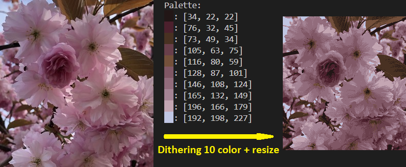

# Ditherum

Ditherum is a Rust library and command-line interface (CLI) tool designed for image dithering and color palette manipulation. It currently supports extracting color palettes from images using multithreaded variant of the [K-means clustering](https://en.wikipedia.org/wiki/K-means_clustering) algorithm and allows saving and loading color palettes in JSON format. Upcoming features include dithering images using the [Floyd-Steinberg algorithm](https://en.wikipedia.org/wiki/Floyd%E2%80%93Steinberg_dithering) and expanded CLI functionality.

<p align="center">
  
</p>

## Features

- **Extract Color Palette**: Extracts a color palette from an image using the K-means centroids algorithm.
- **Save/Load Color Palette**: Save extracted color palettes to a JSON file or load them from a JSON file.
- **Color Reduction**: Attempts to reduce the number of colors in a palette to a specified target using clustering techniques.
- **Dithering (Upcoming)**: CLI support for dithering images using the S_F algorithm.

## Installation

To use Ditherum as a library in your Rust project, add the following to your `Cargo.toml`:

```toml
[dependencies]
ditherum = { git = "https://github.com/your-username/ditherum" }
```

To install the CLI tool:

```sh
cargo install --path .
```

It will install ditherum as ditherum executable.

## Usage

There are 2 modes in ditherum CLI: 
- palette used only to extract color palette from image and/or reduce palette
- dither used to dither image using existing palett and/or palett reduction

### CLI palette examples:

<p align="center">
  
</p>

Extract colors palette from image, reduce it to 8 colors and save to JSON:

```sh
ditherum -v palette --input image.png --output palette.json --colors 8
```

### CLI dither (upcomming) examples:

Dither image using default algorith, image size remain the same:

```sh
ditherum dither --input image.png --output dithered_image.png --palette palette.json
```

Dither image using default algorith, image size remain the same. Additionally reduce polors palette to 8 colors:

```sh
ditherum dither --input image.png --output dithered_image.png --output-palette reduced_palette.json --colors 8
```

### Library

```rust
use ditherum::palette::PaletteRGB;
use image::RgbImage;

// Extract palette from an image
let img = image::open("path/to/image.png").expect("Failed to open image").to_rgb8();
let palette = PaletteRGB::from_image(&img);

// Save palette to JSON
palette.save_to_json("palette.json").expect("Failed to save palette");

// Load palette from JSON
let loaded_palette = PaletteRGB::load_from_json("palette.json").expect("Failed to load palette");

// Reduce the number of colors in the palette
let reduced_palette = loaded_palette.try_reduce(4).expect("Failed to reduce colors");
```

## Tests & Logging
To run test with logging option.

> Log levels: error > warn > info > debug > trace.

Windows:
```cmd
set RUST_LOG=debug && cargo test --features logging -- --nocapture
```

Linux:
```sh
RUST_LOG=debug && cargo test --features logging -- --nocapture
```

### Depelopment test cheatsheet

Windows commands

Help:
```sh
set RUST_LOG=debug && cargo run --bin ditherum -- -h
```

Verbouse palette command with color reduction to 10:
```sh
cargo run --bin ditherum -- -v palette -i res/test_images/test_pink_300.jpg -c 10 -o res/test_results/test_pink_300.json
```

Verbouse palette command with color reduction to 10 and additional debug logging:
```sh
set RUST_LOG=debug && cargo run --bin ditherum --features logging -- -v palette -i res/test_images/test_pink_300.jpg -c 10 -o res/test_results/test_pink_300.json
```

## Palette Reducing Colors

Ditherum uses a clustering technique to reduce the number of colors in a palette while preserving the overall color harmony. It converts sRGB colors to LAB so that colors are transformed more accuratelly.

```rust
let reduced_palette = palette.try_reduce(4).expect("Failed to reduce colors");
```

## Palette JSON Serialization

Saving to JSON.
```rust
palette.save_to_json("palette.json").expect("Failed to save palette");
```

Loading from JSON.
```rust
let loaded_palette = PaletteRGB::load_from_json("palette.json").expect("Failed to load palette");
```

## Roadmap

- [x] Extract color palette from image
- [x] Save and load color palette in JSON format
- [x] Reduce color palette using K-means clustering
- [x] Add CLI palette creation/reduction
- [ ] Add CLI palette visualization tool
- [ ] Add CLI support for dithering images using the Floyd-Steinberg algorithm
- [ ] Add CLI image preprocessing: crop, resize, filters
- [ ] Parameters: proc count, timeout
- [ ] Enhance logging and error handling

## License

This project is licensed under the MIT License.